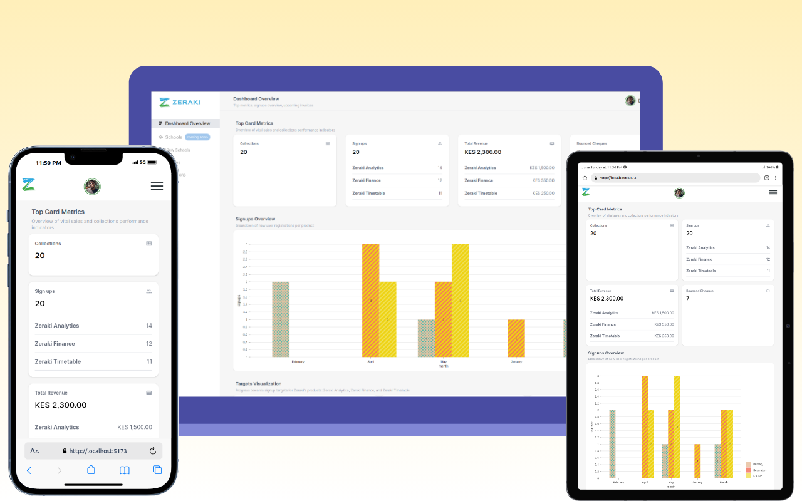

# [sales_agent_dashboard](https://sales-agent-dashboard-demo.vercel.app/)
A mobile-first sales agent dashboard with Vite + React + TypeScript


## Project Overview

Mobile-first Responsive Design:



**Tools:** 
- [React.js](https://react.dev/) is a component based Javascript library for building modern UI.
- [TailwindCSS](https://tailwindcss.com/) is a highly flexible css library allowing for custom styling.
- [Material UI Components](https://mui.com/) has ready to use tree shakeable components for fast development.
- [npm json server](https://www.npmjs.com/package/json-server) allows for mocking of an api server.
- [nivo chart library](https://nivo.rocks/) allows for highly customized charts.

**UI/UX Design:**

- I was going for a hushed minimalistic look with slight curvatures to make it look modern. 
- The colors only stand out in graphs to allow the sales agent to focus on the visualizations.
- A laid-back greyish background allows the chart components to stand out.
- The Navbar stays intact on large screens (laptops and desktops) to give the sales agent a way out of the maze. This also reduces the number of clicks to enhance user navigation.
- The grid like design on the cards that act as the canvas for the graph allows for separation of elements in a clean and stylistic way.
- The Title and Descriptions before the visuals gives inexperienced users context as to what they are seeing on the screen.
- The Typography consists of a single font [Inter](https://fonts.google.com/specimen/Inter) which brings personality to the UI. It is also ranks among the most readable fonts making it perfect for a busy screen like my dashboard.
- I opted to utilize our brand colors sparingly, strategically incorporating light shades of red and blue as accent colors throughout the interface. These accent hues serve as subtle highlights that punctuate key elements, effectively drawing attention to critical components without overwhelming the overall visual balance. By employing a restrained application of our brand colors, I aimed to maintain a cohesive and harmonious aesthetic, ensuring that the interface remains visually appealing and user-friendly. This approach allows the primary content to take center stage while subtly reinforcing our brand identity through thoughtfully placed accents, creating a memorable and cohesive user experience. Example usage includes: the "coming soon" Chip component; border color of the avatar image; action buttons on the data table; background color for the profile section.


## Installation steps:

- Clone the Github repo: https://github.com/Sciederrick/sales_agent_dashboard

- Clone the Github repo: https://github.com/Sciederrick/sales-agent-dashboard-mock-server

- Move to the root directory

- For the frontend:

  - ```bash
    npm install
    ```

  - ```bash
    npm run dev
    ```

- For the backend:

  - ```bash
    pnpm install
    ```

  - ```bash
    npm start
    ```

## Links 
- [Frontend](https://sales-agent-dashboard-demo.vercel.app/)
- [Backend] (https://sales-agent-dashboard-mock-server.vercel.app/)


